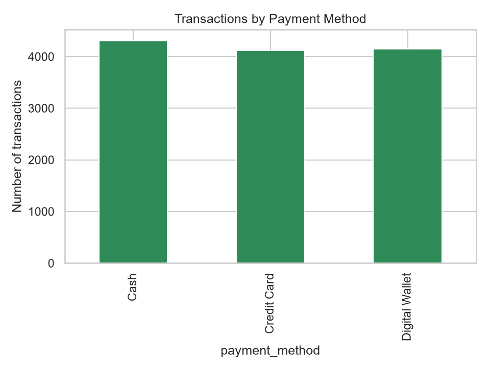
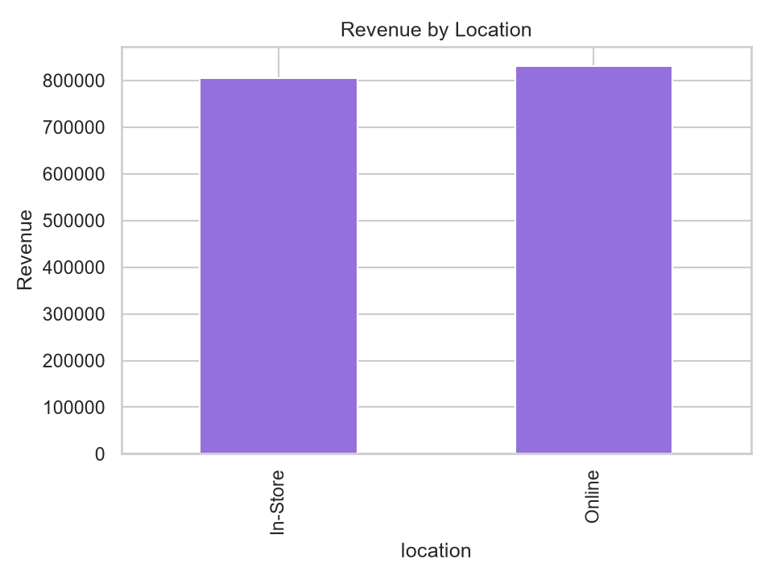
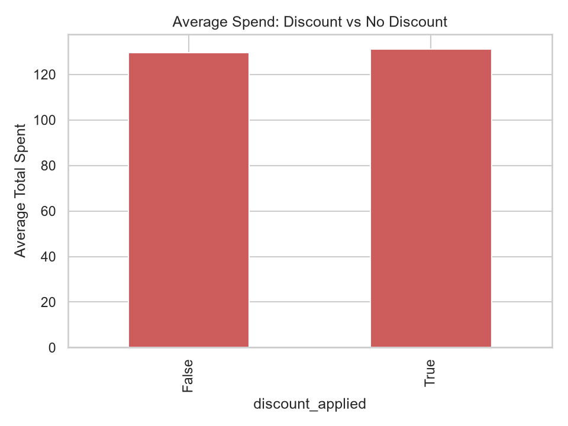
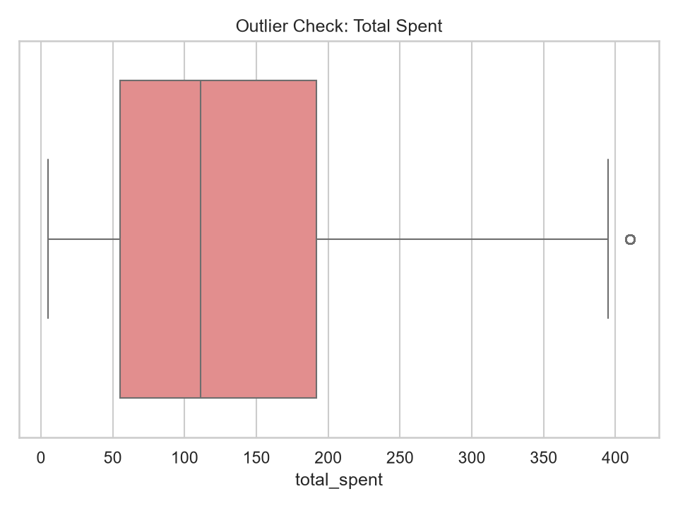
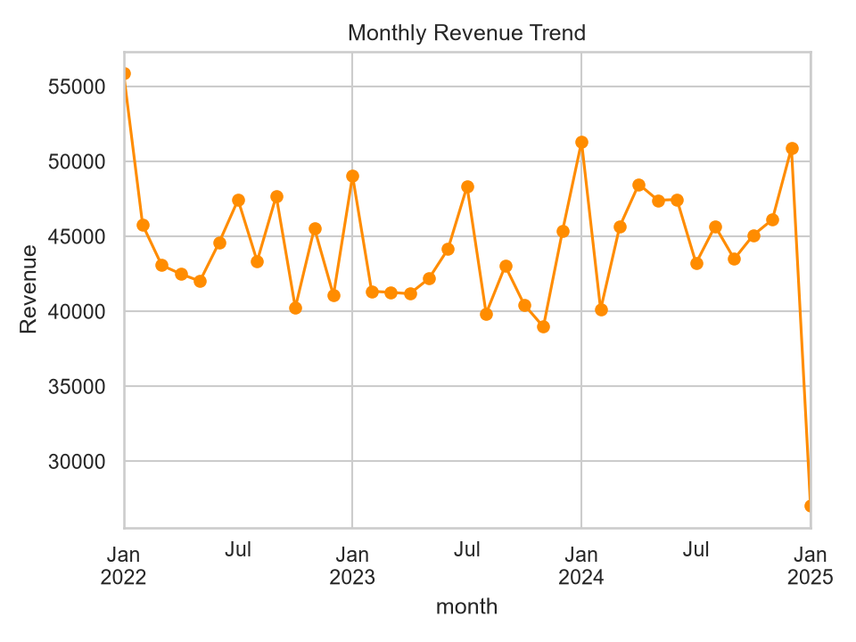
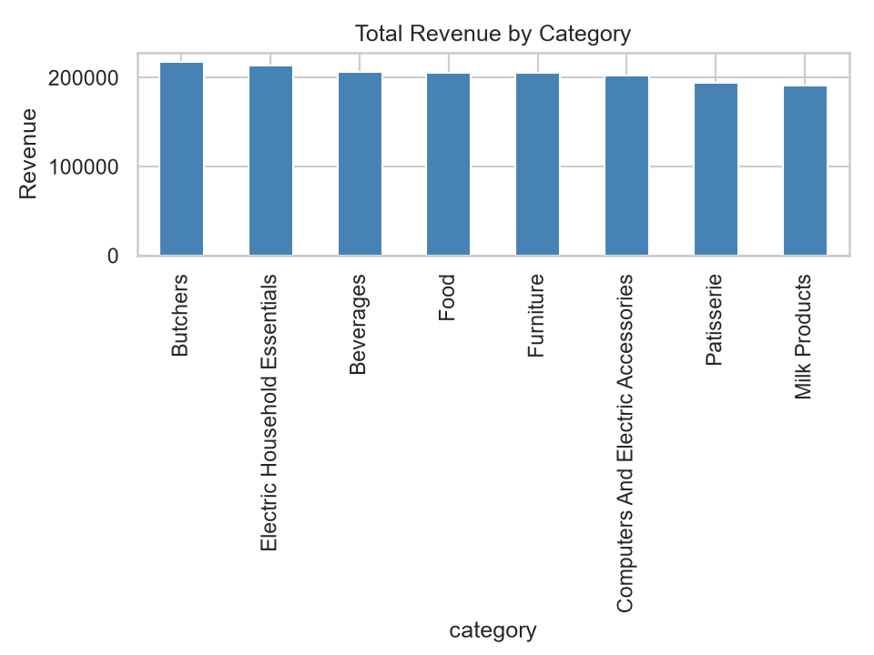

# SWYNEX Technologies — Task 2: Exploratory Data Analysis

**Objective:** Explore the cleaned retail sales dataset from Task 1 and identify useful insights.

**Tools:** Python, Pandas, Matplotlib, Seaborn

## Key Statistics
- Total revenue: 1,636,195.50 (12,575 transactions)
- Average transaction value: about 130.11

## Insights
1. **Payment methods are evenly split.** Cash leads slightly with 34.6% of revenue, followed by Digital Wallet (32.8%) and Credit Card (32.6%).

   

2. **Online and In-Store perform almost equally.** Online earned 831,145 (50.8%) vs In-Store 805,050.5 (49.2%).

   

3. **Discounts barely change spending.** Average spend is 131.13 with a discount vs 129.60 without (about 1.2% higher).

   

4. **Very few anomalies.** Only 56 rows (0.4%) are outliers by the IQR rule.

   

5. **Revenue varies by month.** Jan 2022 was the strongest month (55,886) and Jan 2025 the weakest (27,033.5).

   

## Revenue by Category


## How to run
```
pip install pandas matplotlib seaborn
python eda_analysis.py
```
